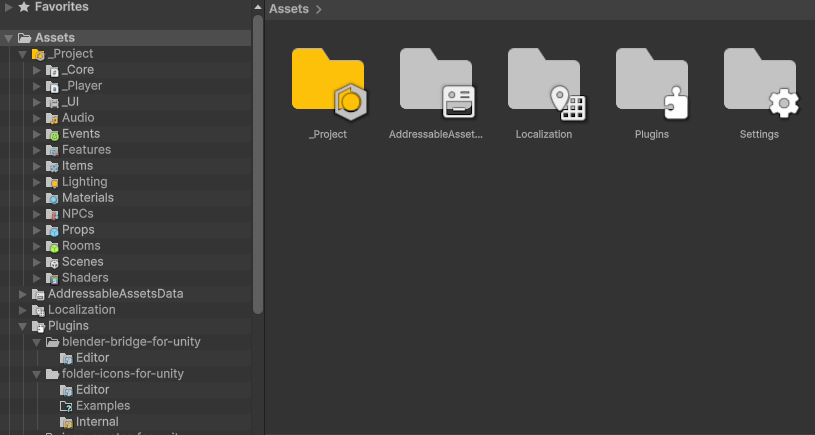
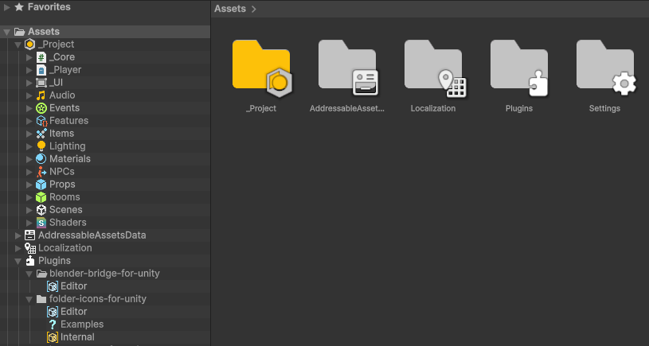
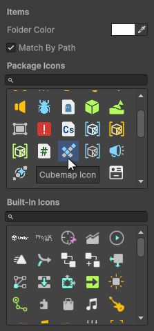

<table>
  <tr>
    <td width="65%" valign="top">
      

        
        
      

    </td>
    <td width="34.2%" valign="top">
      

        
      

    </td>
  </tr>
</table>

Customize your Unity project hierarchy with colors and icons.

---

## Features

* **Folder icons**
  * Match by folder name(s)
  * Match by folder path(s)
* **Custom folder colors**
* **Custom icons**
  * 90 different icons included with the package! Some are [from Unity](https://github.com/jasursadikov/unity-editor-icons/tree/feature/list-instead-of-grid), but are all tweaked heavily to look better in the Project browser
* **Row decorations**
  * Clearer rows (tree view has icon only, work in progress as I hate reflection)
  * Zebra lines (alternating row alphas)
  * Hierarchy lines (like a tree :D)
* **Alt-Click functionality**
* **Support for Unity icons**
  * Icons already included by Folder Icons are excluded :)
* **Works in both list and grid view**
* **Support for empty folders**
* **Preferences integration**
    * Saved in `EditorPrefs`
    * Configurable:
      * Row decorations
      * Sizing (small/large icons, corner offset)
      * Shadows (layers, spread, alpha, offset)
      * Outline (small icon alpha, outline colors)
      * "Rendering" (large icon rounding, min/max large icon size)